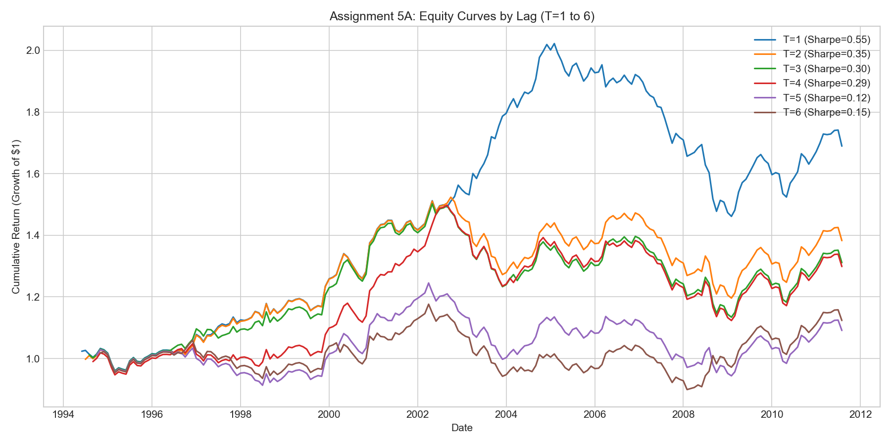
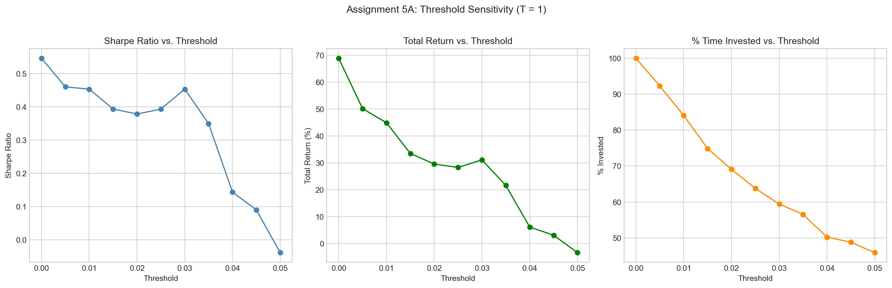
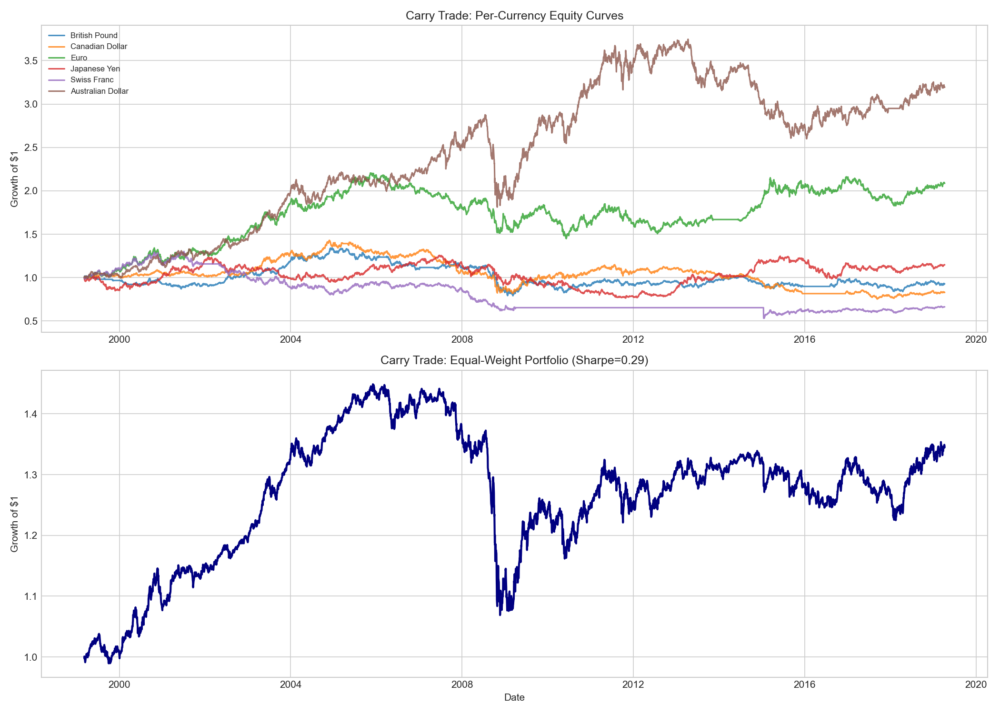
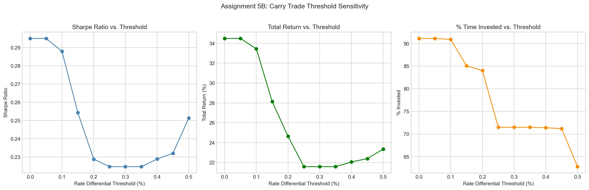

### Lag Analysis Results (T = 1 through 6)

| Lag T | Total Return | Sharpe Ratio | Hit Rate | Max Drawdown | Months Traded |
|------:|-------------:|-------------:|---------:|-------------:|--------------:|
|     1 |       68.93% |        0.546 |    57.0% |      -27.74% |           207 |
|     2 |       38.26% |        0.348 |    54.9% |      -21.50% |           206 |
|     3 |       31.10% |        0.296 |    54.6% |      -24.50% |           205 |
|     4 |       29.85% |        0.288 |    52.9% |      -25.01% |           204 |
|     5 |        9.09% |        0.116 |    49.8% |      -24.20% |           203 |
|     6 |       12.33% |        0.145 |    49.5% |      -23.55% |           202 |

**Best lag by Sharpe ratio: T = 1** (Sharpe = 0.546, total return = 68.93%).

### How does this square with the article's claim?

The article claims that a six-month lagged Basic Balance best predicts the dollar index. Our trading strategy results show that **shorter lags produce better risk-adjusted returns**, with T=1 being the clear winner.

However, there is an important distinction: predictive fit (R-squared of the regression) and trading profitability are different things. The article's claim about T=6 likely refers to explanatory power in a regression context, while our analysis measures whether the directional signal from the model generates positive trading returns. A shorter lag captures more recent capital flow information, which may be more actionable for directional bets even if the longer lag explains more of the level variation.

Critically, **T=1 is not actually tradable** since the Basic Balance data is released with approximately a six-week delay. The best *tradable* lag is T=2 (Sharpe = 0.348, total return = 38.26%), which still outperforms T=6 substantially. Even at T=2, performance is roughly 3x that of T=6 on a total-return basis and 2.4x on a risk-adjusted basis.

---

### Threshold Sensitivity Analysis (T = 1)

Introducing a threshold converts the two-state model (Long/Short) into a three-state model (Long/Short/Neutral). A position is only taken when the absolute difference between predicted and actual ln(TWI) exceeds the threshold.

| Threshold | Total Return | Sharpe | Hit Rate | Max Drawdown | % Months Invested |
|----------:|-------------:|-------:|---------:|-------------:|------------------:|
|     0.000 |       68.93% |  0.546 |    57.0% |      -27.74% |            100.0% |
|     0.005 |       50.20% |  0.460 |    55.0% |      -28.18% |             92.3% |
|     0.010 |       44.95% |  0.453 |    55.7% |      -28.18% |             84.1% |
|     0.015 |       33.54% |  0.394 |    54.8% |      -28.18% |             74.9% |
|     0.020 |       29.60% |  0.378 |    53.8% |      -27.06% |             69.1% |
|     0.025 |       28.34% |  0.393 |    54.5% |      -27.06% |             63.8% |
|     0.030 |       31.15% |  0.453 |    55.3% |      -25.20% |             59.4% |
|     0.035 |       21.64% |  0.350 |    53.8% |      -25.20% |             56.5% |
|     0.040 |        6.17% |  0.144 |    51.9% |      -25.79% |             50.2% |
|     0.045 |        3.14% |  0.090 |    50.5% |      -26.46% |             48.8% |
|     0.050 |       -3.34% | -0.038 |    48.4% |      -25.51% |             45.9% |

- The zero-threshold (always-invested) model delivers the highest absolute return (68.93%) and Sharpe ratio (0.546).
- As the threshold increases, total return drops steadily. At a threshold of 0.03, the Sharpe ratio temporarily recovers to 0.453 while being invested only 59% of the time -- suggesting that moderate filtering removes marginal signals while retaining the strongest ones.
- Beyond a threshold of 0.04, hit rate drops below 52% and returns collapse, indicating that overly aggressive filtering discards too many valid signals.
- A threshold of 0.05 produces negative returns, meaning the strategy can no longer distinguish signal from noise when only acting on large deviations.

The optimal threshold depends on the investor's objective: if the goal is maximizing total return, no threshold is best. If the goal is maximizing return *per unit of time invested*, a threshold around 0.025-0.030 provides a reasonable balance.

---

## Assignment 5B: Carry Trade Strategy

### Strategy Description

The carry trade goes long a foreign currency (versus the dollar) if that country's target interest rate is higher than the US target rate, and short otherwise. If rates are equal, no position is taken. Only FX return is considered; the interest differential income (funding) is ignored per the assignment instructions.

**Data:** Daily observations for 6 currency pairs from March 8, 1999 to April 8, 2019 (5,095 trading days). Currencies: British Pound, Canadian Dollar, Euro, Japanese Yen, Swiss Franc, Australian Dollar.

---

### Base Strategy Results (Threshold = 0)

| Currency           | Total Return | Ann. Sharpe | Hit Rate | Max Drawdown |
|:-------------------|-------------:|------------:|---------:|-------------:|
| British Pound      |       -7.11% |       0.001 |    50.4% |      -41.07% |
| Canadian Dollar    |      -17.09% |      -0.067 |    50.8% |      -47.32% |
| Euro               |      108.58% |       0.423 |    51.8% |      -34.28% |
| Japanese Yen       |       14.76% |       0.118 |    50.4% |      -39.12% |
| Swiss Franc        |      -33.64% |      -0.171 |    51.4% |      -59.19% |
| Australian Dollar  |      219.20% |       0.517 |    52.8% |      -36.98% |
| **Portfolio (EW)** |   **34.49%** |   **0.295** |**53.5%** |  **-26.22%** |

**Key observations:**

- Performance is highly heterogeneous across currency pairs. The **Australian Dollar** (+219%, Sharpe 0.517) and **Euro** (+109%, Sharpe 0.423) are the clear winners, while the **Swiss Franc** (-34%) and **Canadian Dollar** (-17%) are outright losers.
- The **equal-weight portfolio** delivers a 34.49% total return with a Sharpe ratio of 0.295 and a maximum drawdown of -26.22%. Diversification across pairs substantially reduces risk compared to any single pair.
- The **2008 financial crisis** is clearly visible in the equity curves: the portfolio drops from approximately $1.45 to $1.05 in a matter of months as risk-off flows cause rapid unwinding of carry positions. This "crash risk" is the defining feature of carry strategies.
- The portfolio largely recovers by 2014 and delivers modest positive returns through 2019.

---

### Threshold Sensitivity Analysis (0 to 0.5%)

A threshold requires the rate differential to exceed a minimum level before a carry position is taken. If the threshold is not exceeded, no trade is put on for that currency pair.

| Threshold (%) | Total Return | Sharpe | Hit Rate | Max Drawdown | Avg % Pairs Active |
|--------------:|-------------:|-------:|---------:|-------------:|-------------------:|
|          0.00 |       34.49% |  0.295 |    53.5% |      -26.22% |              91.1% |
|          0.05 |       34.49% |  0.295 |    53.5% |      -26.22% |              91.1% |
|          0.10 |       33.44% |  0.288 |    53.4% |      -26.22% |              90.9% |
|          0.15 |       28.13% |  0.254 |    53.0% |      -26.22% |              85.1% |
|          0.20 |       24.64% |  0.229 |    52.8% |      -26.22% |              84.0% |
|          0.25 |       21.58% |  0.225 |    52.8% |      -23.52% |              71.5% |
|          0.30 |       21.58% |  0.225 |    52.8% |      -23.52% |              71.5% |
|          0.35 |       21.58% |  0.225 |    52.8% |      -23.52% |              71.5% |
|          0.40 |       22.06% |  0.229 |    52.9% |      -23.52% |              71.4% |
|          0.45 |       22.39% |  0.232 |    52.9% |      -23.52% |              71.2% |
|          0.50 |       23.35% |  0.251 |    52.9% |      -22.39% |              62.8% |

- Thresholds up to 0.10% have negligible impact because most rate differentials are larger than this.
- At 0.25%, active exposure drops from 91% to 72% of pair-days and total return falls from 34.5% to 21.6%. However, maximum drawdown also improves from -26.2% to -23.5%.
- At 0.50%, the strategy invests in only 63% of pair-days on average and the Sharpe ratio partially recovers to 0.251, suggesting the remaining trades have a better risk/return profile.
- The threshold is effective at filtering out periods when rates are very close (e.g., during zero-interest-rate-policy regimes), where carry signals are weakest.

---

### Assessment of the Carry Trade Strategy

The carry trade strategy produces a **modest positive return** (34.5% over 20 years, or roughly 1.5% annualized) with a **Sharpe ratio of 0.30** when ignoring funding income. This is a relatively low risk-adjusted return, which is not surprising since we are deliberately excluding the interest rate income that is the primary source of carry trade profit.

**Strengths:**
- The strategy has a clear economic rationale: high-yielding currencies tend to attract capital flows that support their value.
- Diversification across 6 pairs meaningfully reduces drawdowns (portfolio max DD of -26% vs. single-pair DDs of -34% to -59%).
- The strategy is simple and rule-based, requiring only publicly available central bank rate information.

**Weaknesses:**
- Carry trades are exposed to severe "crash risk" -- the 2008 crisis wiped out years of accumulated gains in weeks. The portfolio equity curve shows a peak-to-trough decline of roughly 30% during 2008.
- Without the funding income (which we exclude here), the FX-return-only version of the carry trade is only marginally profitable. In practice, the interest differential is what makes carry trades attractive.
- Results are dominated by just two currencies (AUD and EUR), making the strategy less robust than the 6-pair diversification suggests.

**Bottom line:** The carry trade, based on FX returns alone, is a marginally profitable but risky strategy. Its true value comes from combining the FX directional bet with the interest income from the rate differential. Adding a threshold filter can modestly improve the risk profile but reduces absolute returns.
